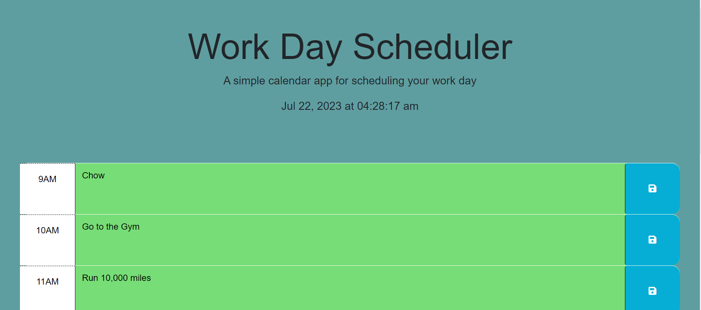

# Work Day Scheduler Code
Seriouly fun to work on!
I researched how to apply all the methods but the code is all mine. 
I really like learning by doing.
This Challenge made me realize I need to work more on functions and creating iteration loops. 
I understand the DOM structure and how to navigate it a LOT better after this project.
If I borrowed code it was from the activities in class.
